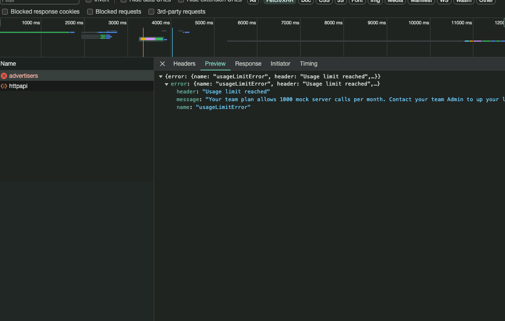

# Advertisers

This project was generated with [Angular CLI](https://github.com/angular/angular-cli) version 17.3.5.

## Notes

POST Request are intercepted so that they return the request object with a generated ID, these are used when creating new advertisers and addresses

The modal implementation is quite basic, in a real project where there will be multiple modals with different content it will maake more sense to have a service to add the modals in the dom.

## Development server

Because there were some issues with the endpoints - was receiving a "usage limit" error - I created a separate configuration called Mock.
This will work on the interceptor layer redirecting the requests to the JSON files in the `src/mocks` folder.

To run this you can use `npm run start:mock`.

Alternatively, running `npm start` will run in dev mode with requests going to the provided endpoints

## Build

Run `npm run build` to build the project. The build artifacts will be stored in the `dist/` directory.

## Running unit tests

Run `npm test` to execute the unit tests via [Karma](https://karma-runner.github.io).

